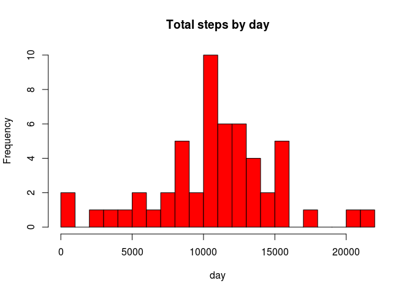
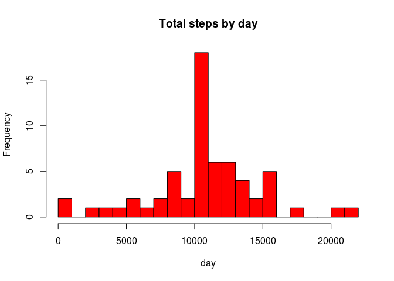
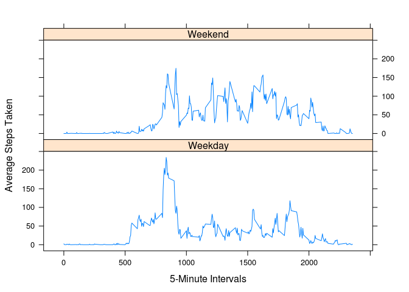

# Reproducible Research: Peer Assessment 1

#Reproducible Research Peer Assessment 1: Activity monitoring
#Dainius Tulaba

##Introduction

It is now possible to collect a large amount of data about personal movement
using activity monitoring devices such as a **Fitbit**, **Nike Fuelband**,
or **Jawbone Up**. These type of devices are part of the “quantified self”
movement – a group of enthusiasts who take measurements about themselves
regularly to improve their health, to find patterns in their behavior, or
because they are tech geeks. But these data remain under-utilized both because
the raw data are hard to obtain and there is a lack of statistical methods and
software for processing and interpreting the data.

This assignment makes use of data from a personal activity monitoring device.
This device collects data at 5 minute intervals through out the day. The data
consists of two months of data from an anonymous individual collected during
the months of October and November, 2012 and include the number of steps taken
in 5 minute intervals each day.

##Data

The data for this assignment can be downloaded from the course web site:

Dataset: [Activity monitoring data](https://d396qusza40orc.cloudfront.net/repdata%2Fdata%2Factivity.zip) (52K)

You can download it by clicking on a link and unzip in desired directory, or
just run code in your RStudio. This will download, save, unzip data in working
directory and delete downloaded zip file after for saving space and getting
rid off the garbage. You can find your working direcotry with function
`getwd()` and chage to desired directory using command `setwd() `.

### Loading and preprocessing the data

Show any code that is needed to

1. Load the data (i.e. `read.csv()`)

2. Process/transform the data (if necessary) into a format suitable for your analysis


```r
Sys.setlocale("LC_TIME", "C")
```

```
## [1] "C"
```

```r
dataset <- function () {
     fileurl <- "https://d396qusza40orc.cloudfront.net/repdata%2Fdata%2Factivity.zip"
     download.file(fileurl, destfile="./activity.zip", method="curl")
     system("unzip -d ./ ./activity.zip")
     system("rm -r ./activity.zip")
}
dataset()
activity <- read.csv("activity.csv", sep = ",", header = TRUE)
```

The variables included in this dataset are:

- steps: Number of steps taking in a 5-minute interval (missing values are coded as `NA`)

- date: The date on which the measurement was taken in `YYYY-MM-DD` format

- interval: Identifier for the 5-minute interval in which measurement was taken

The dataset is stored in a comma-separated-value (CSV) file and there are
a total of 17,568 observations in this dataset.
We can inspect if data loaded all records and variables:


```r
str(activity)
```

```
## 'data.frame':	17568 obs. of  3 variables:
##  $ steps   : int  NA NA NA NA NA NA NA NA NA NA ...
##  $ date    : Factor w/ 61 levels "2012-10-01","2012-10-02",..: 1 1 1 1 1 1 1 1 1 1 ...
##  $ interval: int  0 5 10 15 20 25 30 35 40 45 ...
```

and how it looks like:
 

```r
head(activity)
```

```
##   steps       date interval
## 1    NA 2012-10-01        0
## 2    NA 2012-10-01        5
## 3    NA 2012-10-01       10
## 4    NA 2012-10-01       15
## 5    NA 2012-10-01       20
## 6    NA 2012-10-01       25
```

```r
summary(activity)
```

```
##      steps               date          interval   
##  Min.   :  0.0   2012-10-01:  288   Min.   :   0  
##  1st Qu.:  0.0   2012-10-02:  288   1st Qu.: 589  
##  Median :  0.0   2012-10-03:  288   Median :1178  
##  Mean   : 37.4   2012-10-04:  288   Mean   :1178  
##  3rd Qu.: 12.0   2012-10-05:  288   3rd Qu.:1766  
##  Max.   :806.0   2012-10-06:  288   Max.   :2355  
##  NA's   :2304    (Other)   :15840
```

### What is mean total number of steps taken per day?

For this part of the assignment, you can ignore the missing values in
the dataset.

1. Make a histogram of the total number of steps taken each day


```r
library(lattice)
activity$date <- as.Date(activity$date, "%Y-%m-%d")
dailysteps <- aggregate(steps ~ date, data = activity, FUN = sum, na.rm = TRUE)
hist(dailysteps$steps, main = "Total steps by day", xlab = "day", col = "red", breaks = 26)
```

 

2. Calculate and report the **mean** and **median** total number of steps taken per day


```r
mean(dailysteps$steps)
```

```
## [1] 10766
```

```r
median(dailysteps$steps)
```

```
## [1] 10765
```

### What is the average daily activity pattern?

1. Make a time series plot (i.e. `type = "l"`) of the 5-minute interval (x-axis)
and the average number of steps taken, averaged across all days (y-axis)


```r
intervalsteps <- aggregate(steps ~ interval, data = activity, FUN = mean)
plot(intervalsteps, type = "l")
```

 

2. Which 5-minute interval, on average across all the days in the dataset,
contains the maximum number of steps?


```r
intervalsteps$interval[which.max(intervalsteps$steps)]
```

```
## [1] 835
```

### Imputing missing values

Note that there are a number of days/intervals where there are missing
values (coded as `NA`). The presence of missing days may introduce
bias into some calculations or summaries of the data.

1. Calculate and report the total number of missing values in the dataset 
(i.e. the total number of rows with `NA`s)


```r
sum(is.na(activity))
```

```
## [1] 2304
```

2. Devise a strategy for filling in all of the missing values in the dataset.
The strategy does not need to be sophisticated. For example, you could use
the mean/median for that day, or the mean for that 5-minute interval, etc.


```r
stepsbyinterval <- aggregate(steps ~ interval, data = activity, FUN = mean)
fillNA <- numeric()
for (i in 1:nrow(activity)) {
    obs <- activity[i, ]
    if (is.na(obs$steps)) {
        steps <- subset(stepsbyinterval, interval == obs$interval)$steps
    } else {
        steps <- obs$steps
    }
    fillNA <- c(fillNA, steps)
}
```

3. Create a new dataset that is equal to the original dataset but with
the missing data filled in.


```r
activityfilled <- activity
activityfilled$steps <- fillNA
```

4. Make a histogram of the total number of steps taken each day and Calculate
and report the **mean** and **median** total number of steps taken per day.
Do these values differ from the estimates from the first part of the assignment?
What is the impact of imputing missing data on the estimates of the total daily
number of steps?


```r
dailystepsfilled <- aggregate(steps ~ date, data = activityfilled, FUN = sum, na.rm = TRUE)
hist(dailystepsfilled$steps, main = "Total steps by day", xlab = "day", col = "red", breaks = 26)
```

 

```r
mean(dailysteps$steps)
```

```
## [1] 10766
```

```r
median(dailysteps$steps)
```

```
## [1] 10765
```

```r
mean(dailystepsfilled$steps)
```

```
## [1] 10766
```

```r
median(dailystepsfilled$steps)
```

```
## [1] 10766
```

We can see that median is the same for both datasets and mean differs by 1. 
From chart could be infered that quantity of days with average steps increased
(actually we increased it by putting mean instead of `NA`s), other frequencies
left unchanged.

### Are there differences in activity patterns between weekdays and weekends?

For this part the `weekdays()` function may be of some help here. Use
the dataset with the filled-in missing values for this part.

1. Create a new factor variable in the dataset with two levels -- "weekday" and
"weekend" indicating whether a given date is a weekday or weekend day.


```r
activity$day <- weekdays(as.Date(activity$date))
daylevel <- vector()
for (i in 1:nrow(activity)) {
    if (activity$day[i] == "Saturday") {
        daylevel[i] <- "Weekend"
    } else if (activity$day[i] == "Sunday") {
        daylevel[i] <- "Weekend"
    } else {
        daylevel[i] <- "Weekday"
    }
}
activity$daylevel <- daylevel
activity$daylevel <- factor(activity$daylevel)

stepsbyday <- aggregate(steps ~ interval + daylevel, data = activity, mean)
names(stepsbyday) <- c("interval", "daylevel", "steps")
```

2. Make a panel plot containing a time series plot (i.e. `type = "l"`) of
the 5-minute interval (x-axis) and the average number of steps taken, averaged
across all weekday days or weekend days (y-axis).


```r
xyplot(steps ~ interval | factor(daylevel),
       data=stepsbyday,
       type = 'l',
       layout = c(1, 2),
       xlab="5-Minute Intervals",
       ylab="Average Steps Taken")
```

 
